# AI Quality Audit: O Desafio Gilded Rose

## Atividades

- Gerar testes unitários completos
- Gerar testes com 100% de cobertura
- Criar cenários BDD
- Refatorar com Clean Code

## Metodologia

A condução deste projeto adotou uma metodologia híbrida, combinando técnicas de Engenharia de Prompt, Auditoria de Qualidade e Testes Automatizados, com suporte a LLMs. A abordagem estruturou-se em fases iterativas e mensuráveis, orientadas aos objetivos definidos na atividade do Gilded Rose Kata.

### Chain of Thought (CoT)

Foi empregada de forma estruturada para decompor problemas complexos em etapas menores e verificáveis. O CoT orientou:

- a análise incremental do código legado;
- o raciocínio passo a passo para geração de testes;
- a identificação de cenários de borda;
- a verificação lógica das respostas do modelo.

Essa técnica contribuiu para reduzir riscos de alucinação, reforçando o rigor lógico exigido no papel de Auditor de Qualidade.

### Persona Pattern

A IA foi instruída a assumir diferentes “papéis”, como:

- Engenheiro de Testes experiente;
- Auditor de Qualidade;
- Desenvolvedor especialista em Clean Code;
- Especialista em BDD com Cucumber.

Cada persona forneceu respostas mais contextuais e especializadas, aumentando a precisão da geração de artefatos e a qualidade da refatoração conduzida.

## Roadmap "Chain of Thoughts" para o Gilded Rose

0. Setup e contexto

**Objetivo:** garantir que a IA entenda o contexto do trabalho (linguagem, Jest, Stryker, papel de “auditor”).

- Prompt base (persona + contexto):

> Você é um especialista em JavaScript, Jest, Clean Code, Testes de Mutação (Stryker) e testes de software.  
> Vamos trabalhar no kata “Gilded Rose” da Emily Bache (JS). 
> Seu papel é me ajudar a criar testes robustos, refatorar o código sem mudar comportamento e gerar cenários BDD. 
> Sempre explique seu raciocínio passo a passo (cadeia de pensamento) e deixe claras suas suposições.

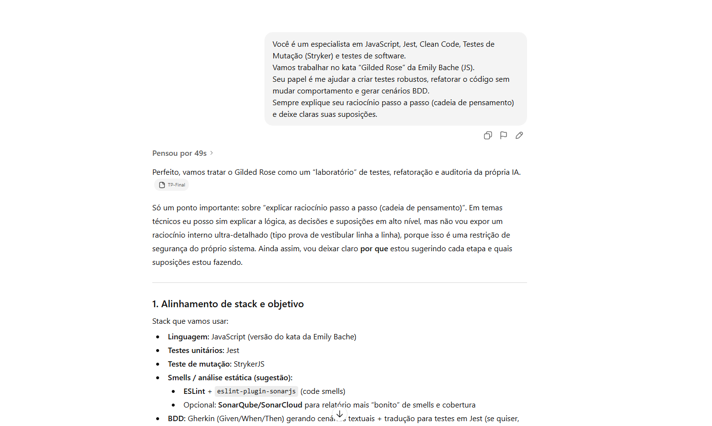

1. Entender o domínio e extrair a especificação

**Objetivo:** transformar o README + código em uma especificação explícita (tabela de regras de negócio).

- Prompt:

> Com base nessas regras e no código abaixo, extraia uma especificação funcional do sistema Gilded Rose.
>
> 1. Liste todos os tipos de item conhecidos (Common, Aged Brie, Backstage pass, Sulfuras, Conjured se existir, etc.).
> 2. Para cada tipo, produza uma tabela com:
>
> - Condição (ex: “sellIn > 0”, “sellIn <= 0”)
> - Como quality varia (−1, −2, +1, +2, zera, etc.)
> - Limites de quality (0 a 50, exceções).
>
> 3. Aponte possíveis ambiguidades ou regras que não estão claras.
>    Explique seu raciocínio passo a passo.

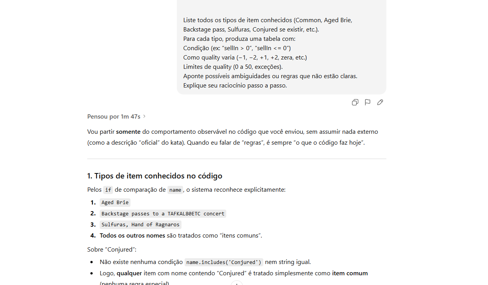

2. Planejar cenários de teste

- Prompt:

> Usando a especificação que você acabou de gerar, planeje uma matriz de testes para o método updateQuality.
>
> 1. Liste os casos de teste em alto nível (ex: “Aged Brie aumenta a qualidade, mas respeita limite 50”).
> 2. Inclua explicitamente casos de borda: quality = 0, quality = 50, sellIn = 0, sellIn = 1, etc.
> 3. Não gere código ainda, apenas descreva:
>
> - Nome do caso
> - Tipo de item
> - Entrada inicial (sellIn, quality)
> - Estado esperado após uma chamada de updateQuality.
>
> 4. Explique por que cada caso é importante.

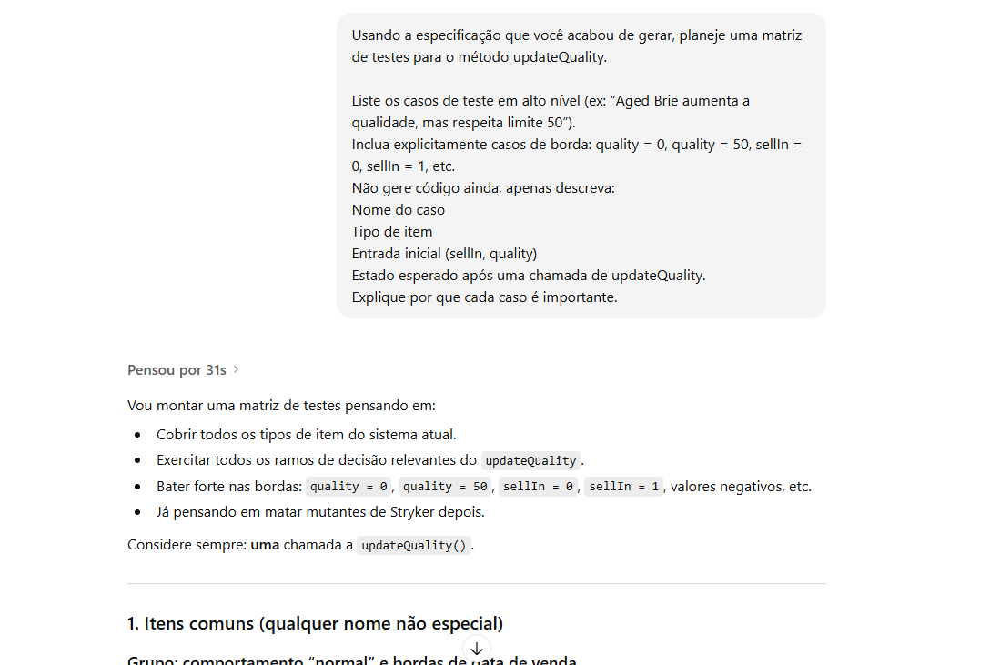

3. Gerar testes unitários Jest (primeiro round)

**Objetivo:** criar uma suíte inicial em Jest, focada em comportamento, não em implementação.

- Prompt:

> Agora gere testes unitários em Jest para o método updateQuality do Gilded Rose em JavaScript.
> Regras:
>
> - Não altere o código de produção ainda.
> - Use AAA (Arrange-Act-Assert).
> - Não use lógica condicional (if, for) dentro dos testes.
> - Cada it deve testar um cenário da matriz que você planejou.
> - Dê nomes descritivos para os testes.
> - Evite números mágicos: comente o porquê dos valores escolhidos.

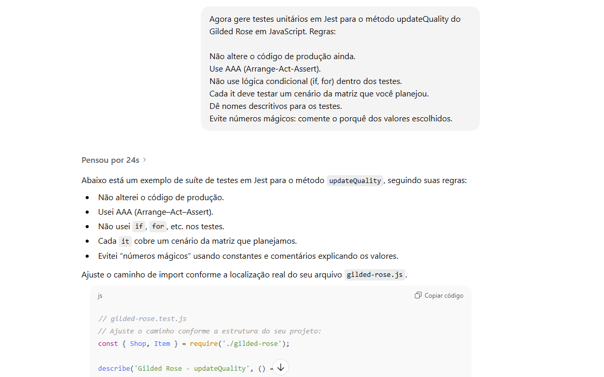

4. Auditar cobertura e lacunas (prompt de inspeção)

**Objetivo:** usar o relatório de cobertura para encontrar buracos.

- Prompt:

> Aqui está o relatório de cobertura do Jest (resumo).  
> Aponte quais caminhos lógicos de updateQuality ainda não estão cobertos.  
> Sugira novos casos de teste específicos para cobrir cada branch faltante, usando a mesma estrutura da matriz de testes anterior.  
> Depois gere apenas os novos testes Jest necessários.

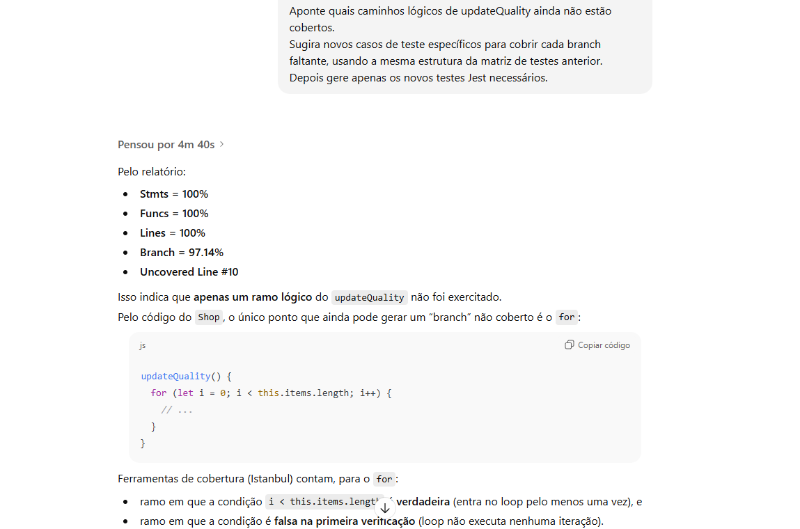

5. Teste de Mutação com Stryker

**Objetivo:** descobrir se os testes realmente “pegam” mudanças sutis.

- Prompt:

> A seguir estão mutantes sobreviventes do Stryker (JS) com o trecho de código e tipo de mutação.  
> Explique, em português simples, o que cada mutação alterou no comportamento.  
> Para cada mutante sobrevivente, proponha um ou mais casos de teste adicionais capazes de matá-lo.  
> Em seguida, gere os testes Jest correspondentes.  
> Use AAA, sem if dentro dos testes, e foque em validar o comportamento de negócio correto.

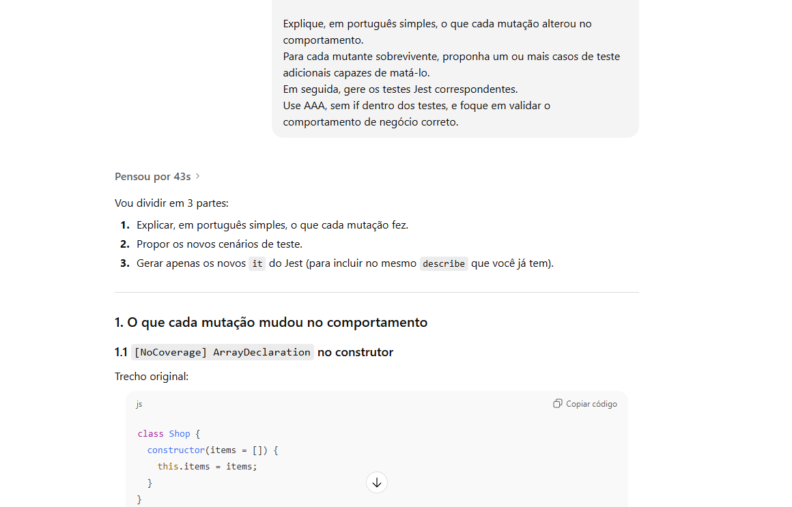

6. Identificar Test Smells nos testes gerados

**Objetivo:** encontrar test smells e melhorá-los.

- Prompt:

> 1. Identifique possíveis test smells, como:
>
> - Assertion Roulette
> - General Fixture
> - Código duplicado em setup
> - Testes muito grandes/ambíguos
>
> 2. Explique por que cada caso é um smell.
> 3. Proponha uma versão refatorada dos testes, mantendo o mesmo comportamento, mas com melhor legibilidade e manutenção."

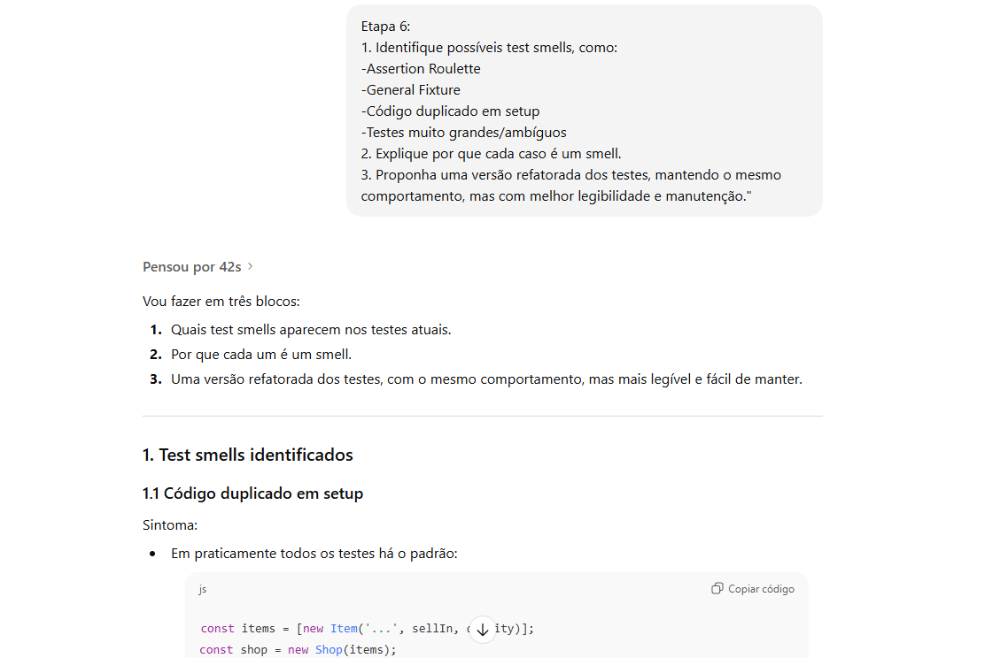

7. Só agora: refatoração do código de produção

**Objetivo:** refatorar updateQuality mantendo o comportamento.

- Prompt:

> Agora, com base nesses testes de regressão, proponha uma refatoração incremental do método updateQuality.  
> Regras:
>
> - Não mude o comportamento observado pelos testes.
> - Explique, passo a passo, cada refatoração (extração de método, criação de classe, Strategy, etc.).
> - A cada etapa, descreva quais testes garantem que o comportamento foi preservado.
> - Evite introduzir condicionais mais complexas do que já existem.
> - Comece com pequenas refatorações locais (extração de funções nomeadas) antes de sugerir grandes mudanças de design.

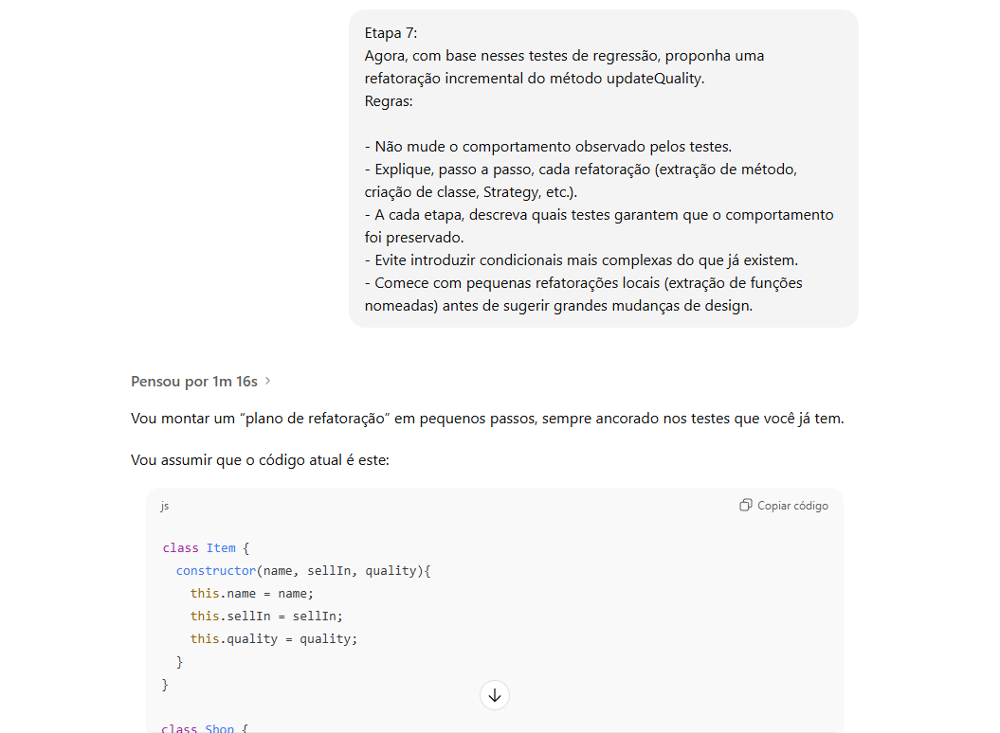

8. Geração de cenários BDD (Given–When–Then)

**Objetivo:** transformar regras de negócio em cenários Gherkin.

- Prompt:

> Com base na especificação funcional e no comportamento atual validado pelos testes, gere cenários BDD em Gherkin para o Gilded Rose.
>
> - Use Given/When/Then.
> - Separe por tipo de item.
> - Inclua explicitamente cenários de borda (quality 0, 50, sellIn 0, vencido, etc.).
> - Use linguagem de negócio (estoque, qualidade, prazo), não termos técnicos demais.

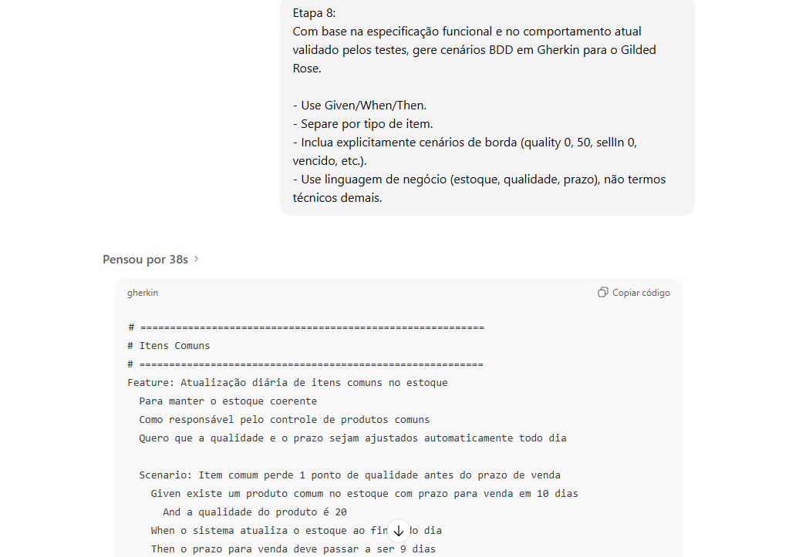

9. Geração dos Step Definitions (arquivos de steps)

**Objetivo:** Gerar os steps para os testes BDD.

> Agora gere o arquivo de Step Definitions para os cenários BDD abaixo, usando a biblioteca @cucumber/cucumber.  
> Regras obrigatórias:  
> - Use Given, When, Then importados de @cucumber/cucumber.
> - Todos os steps devem operar diretamente sobre o método updateQuality() do Gilded Rose.
> - Mantenha variáveis de contexto no this (ou World) para armazenar item, gildedRose, result etc.
> - Não duplique lógica: se múltiplos cenários compartilham steps semelhantes, gere steps reutilizáveis.
> - Use assertivas do Node.js (assert.strictEqual).
> - Cada step deve sempre explicar internamente o que está fazendo (ex: atualizar sellIn, criar item, chamar updateQuality).
> - Não reescreva as regras de negócio: apenas teste comportamento.
> - Ao final, produza um arquivo completo, por exemplo: `features/step_definitions/gildedRose.steps.js.`  
> Antes de gerar o arquivo final, mostre seu raciocínio passo a passo (Chain of Thought), identificando:  
> – quais steps são “Given”, quais são “When”, quais são “Then”  
> – como manter o contexto entre steps  
> – quais variáveis precisam ser persistidas entre steps

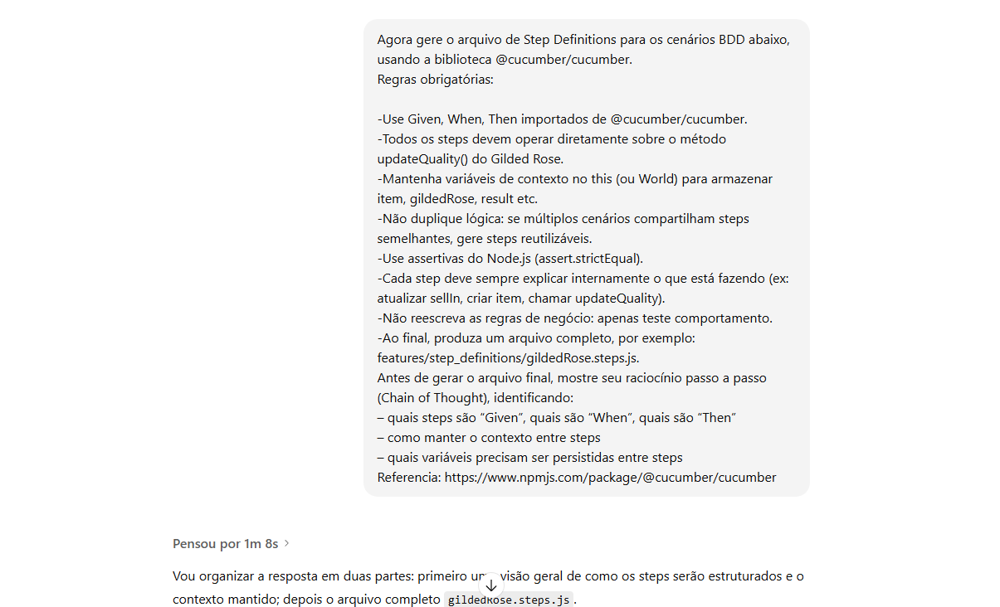

## Resultados

### Testes Unitários

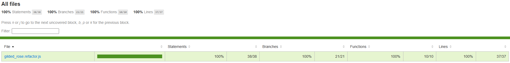

### Multações

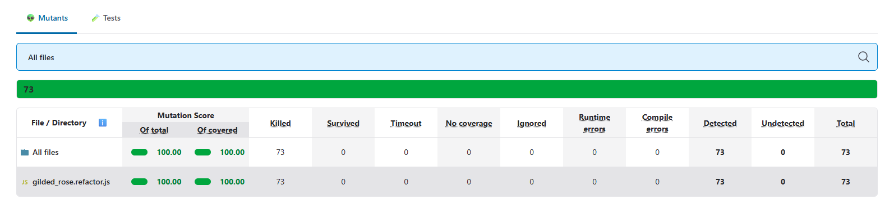

### BDD - Behavior Driven Development

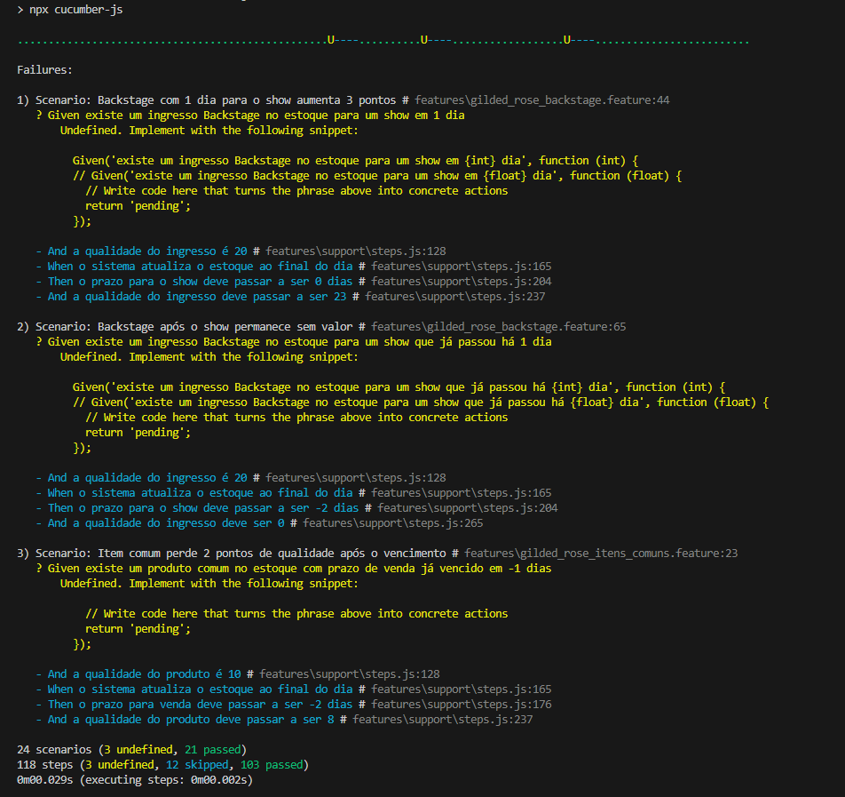

### Smells Tests Identificados

Smells Tests identificados antes da refatoração `Etapa 6`.

#### Smells inicialmente identificados

1. Assertion Roulette (parcial)

- Onde: teste integrado “deve atualizar corretamente um inventário com múltiplos tipos de item”, na versão original com várias expect soltas.
- Problema: difícil saber qual parte da regra de negócio falhou, reduz clareza de diagnóstico.
- Status após refatoração: mitigado usando expect(items).toEqual(expectedItems).

2. General Fixture

- Onde: não há um caso claro.
- Análise: não existe beforeEach genérico criando um cenário gigante que não é usado por todos os testes; o fixture mais “gordo” (estoque com vários itens) é específico daquele cenário.
- Conclusão: esse smell não se aplica à sua suíte atual.

3. Código duplicado em setup

- Onde: praticamente em todos os testes unitários (criação repetida de new Item, new Shop, arrays etc.).
- Problema: alto custo de manutenção, possível inconsistência, obscurece a lógica específica de cada cenário.
- Status após refatoração: mitigado com createShopWithSingleItem e agrupamento por tipo.

4. Testes grandes / ambíguos

- Onde: teste integrado com múltiplos itens e várias asserções.
- Problema: mistura várias regras de negócio num único teste, reduzendo a clareza sobre “o que exatamente estou testando”.
- Status após refatoração: ainda existe como teste de integração, mas mais legível e com papel claro (sanity check).
    
#### Smells adicionais relevantes

1. Redundância de testes

- Onde: evidenciada no log de Jest com nomes duplicados (provável duplicidade de arquivo ou definição).
- Problema: aumenta manutenção sem aumentar cobertura ou mutation score; dificulta entender quais testes são canônicos.
- Ação recomendada: garantir que cada cenário de negócio importante tenha um único teste-fonte.

2. Naming às vezes pouco orientado a comportamento

- Onde: alguns testes têm nomes bons, outros poderiam deixar mais explícito o objetivo de negócio.
- Problema: reduz a função dos testes como documentação viva do sistema.
- Ação recomendada: manter padrão de nomes do tipo “deve [regra de negócio] quando [condição]”.

3. Eager Test (teste integrado que verifica muita coisa)

- Onde: deve atualizar corretamente um inventário com múltiplos tipos de item.
- Problema: mistura várias regras de negócio, pode levar a mudanças em cascata quando uma única regra muda.
- Ação recomendada: manter esse teste, mas enxuto e com entendimento de que ele é um “smoke test”, não a especificação principal.

## Referência

> https://www.ibm.com/think/topics/chain-of-thoughts